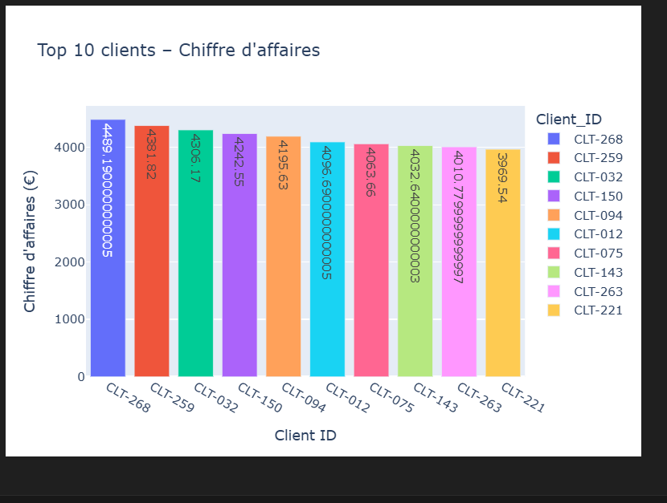

# 📊 Sales Dashboard Ecommerce – Suivi des Ventes & Performance Commerciale

Projet pédagogique pour apprendre à manipuler des données de ventes, analyser la performance commerciale, visualiser les KPIs et utiliser des outils comme Python, Power BI et SQL.
Créé dans le but de **développer mes compétences en Data Analyse & Visualisation** 

---
## 🎯 Objectifs du projet

- Nettoyer, manipuler et explorer des données de ventes
- Calculer des KPIs essentiels : chiffre d’affaires, top produits, performances des commerciaux, etc.
- Créer des visualisations interactives et lisibles
- Structurer un projet professionnel et versionné (Git/GitHub)

---

## 🛠️ Technologies utilisées

- **Python 3.11+**
- **Pandas** : manipulation des données
- **Plotly Express** : visualisations interactives
- **Jupyter Notebook** sous VS Code
- **Excel / Power BI** pour comparaison d'usage

---

## 📁 Structure du projet
sales-dashboard-ecommerce/
│
├── data/ # Données CSV
│ └── sales_data.csv
│
├── notebooks/ # Analyse principale
│ └── sales_analysis.ipynb
│
├── figures/ # (optionnel) Captures de graphiques
│
├── requirements.txt # Librairies Python utilisées
├── README.md # Ce fichier
└── .gitignore # Fichiers à exclure
---

## 📈 KPIs & Analyses réalisées

- ✅ Chiffre d'affaires global
- ✅ Top 5 produits vendus
- ✅ Évolution mensuelle des ventes
- ✅ Meilleurs commerciaux
- ✅ Répartition géographique (régions)
- ✅ Analyse par catégories
- ✅ Top clients

---

## ✨ Exemples de visualisations

---

## 🙋‍♀️ Auteure

**Esther Silenou**  
📧 [foundoesther@gmail.com]    

---

## 💡 À venir

- [ ] Export PDF / HTML du dashboard
- [ ] Intégration dans Power BI

| 📦 Bibliothèque | Utilité                    |
| --------------- | -------------------------- |
| `pandas`        | Manipulation de données    |
| `numpy`         | Calculs numériques         |
| `matplotlib`    | Graphiques simples         |
| `seaborn`       | Graphiques avancés / style |
| `jupyterlab`    | Interface Notebook         |
